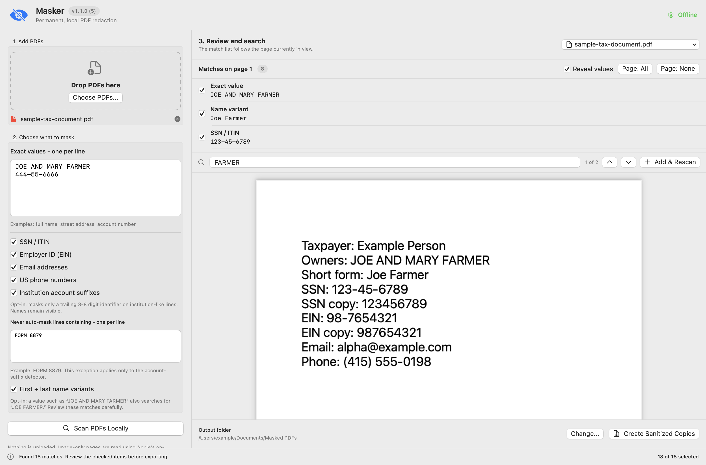

# Masker

**Offline, permanent PDF redaction for macOS.**

Masker finds repeated personal information, lets you review every proposed mask in a continuous PDF view, and creates sanitized copies without uploading the document or its contents.



## Why

Preview's redaction tool is effective, but selecting every occurrence by hand is tedious. Masker automates the repetitive part while keeping the consequential decision - what gets removed - visible and reversible until export.

Read the short development story: [I vibe-coded a PDF redactor because I needed one](docs/why-masker.md).

## Features

- Exact-value matching across one or more PDFs.
- SSN/ITIN, EIN, email, and US phone detection.
- Compact nine-digit variants when a formatted SSN/ITIN or EIN is found.
- Opt-in first-and-last name variants: `JOE AND MARY FARMER` can also find `Joe Farmer`.
- Opt-in institution account-suffix detection that keeps names such as `MERRILL LYNCH` visible.
- Line-scoped exceptions for false positives such as `FORM 8879`.
- Search-as-you-type with previous/next navigation and cached on-device OCR; selected masks are omitted from results.
- Continuous-scroll review with matches synchronized to the visible page.
- Permanent export that removes the original text layer, forms, annotations, attachments, scripts, layers, and metadata.

## Try it

Download the universal macOS build from the [latest release](https://github.com/cpatil/masker/releases/latest), unzip it, and open `Masker.app`. It includes native Apple Silicon and Intel executables.

The downloadable build is ad-hoc signed, not Apple-notarized. On first launch, macOS may require you to right-click the app and choose **Open**. You can also build it directly from source.

### Build from source

Requirements: macOS 13 or newer and Xcode Command Line Tools. Full Xcode and third-party dependencies are not required.

```sh
git clone https://github.com/cpatil/masker.git
cd masker
./build.sh
open Masker.app
```

The build uses SwiftUI, PDFKit, Vision, Core Graphics, and Core Text from macOS.

Maintainers can create the universal release archive with `./package-release.sh`.

## Use it

1. Drop in one or more PDFs.
2. Enter exact values to mask, one per line.
3. Enable any additional detectors you want.
4. Click **Scan PDFs Locally**.
5. Scroll through the PDF and uncheck anything that should remain visible.
6. Search for possible variants; use **Add & Rescan** when you find another value to remove.
7. Click **Create Sanitized Copies**.

Masker never overwrites an original. Output names end in `_masked.pdf`; if that name exists, a number is added.

## What "permanent" means

Each exported page is rebuilt from sanitized pixels at 300 DPI. The original PDF objects are not copied into the output. Masker then reopens and validates the result before reporting success.

This intentionally makes the sanitized PDF non-searchable and non-editable. It also increases file size compared with object-level redaction.

## Privacy and limitations

- Processing is local. Image-only pages use Apple's on-device Vision OCR.
- Nothing in the app uploads documents, extracted text, or search terms.
- OCR and pattern matching can miss handwriting, unusual typography, separated digits, or poor scans.
- Automatic detectors can produce false positives. Review every selected match and every output page before sharing.
- Masker is a privacy tool, not a guarantee of regulatory compliance.

## Tests

```sh
./test.sh
```

The self-test generates its own searchable, scanned, and rotated PDFs. It covers the `JOE AND MARY FARMER` to `Joe Farmer` name variant, identifier variants, institution suffixes, exceptions, cached OCR search, permanent export, and residual-text checks. No tax documents or private fixtures are stored in this repository.

An optional local-only corpus test is also available:

```sh
./private-smoke-test.sh /path/to/private/pdf/folder
```

It reports aggregate counts, creates its temporary output outside the repository, and removes that output after validation.

## License

[MIT](LICENSE)
