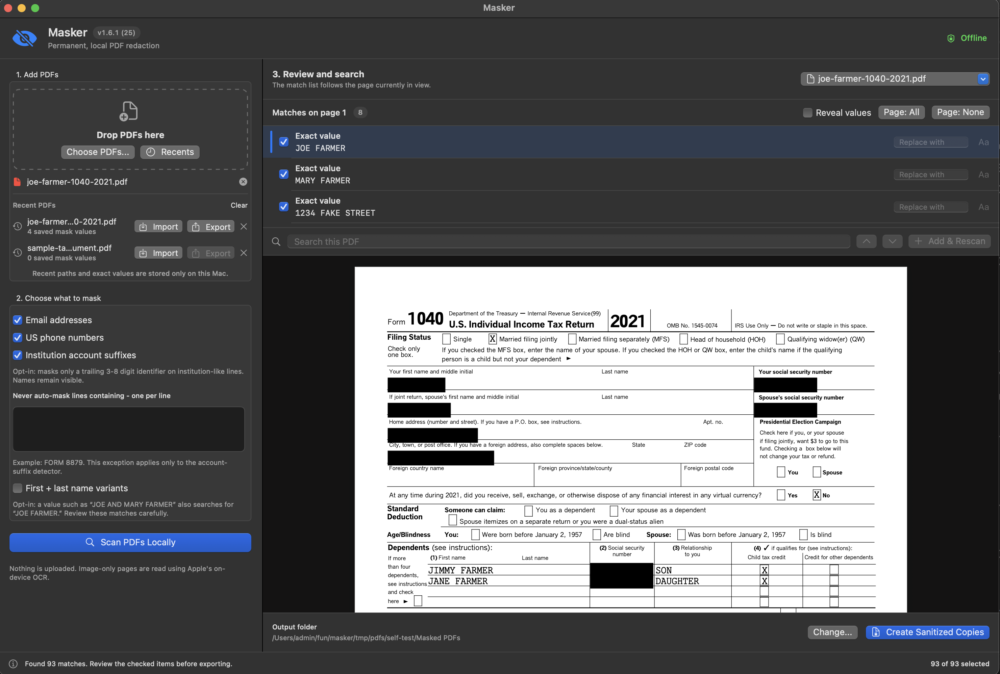
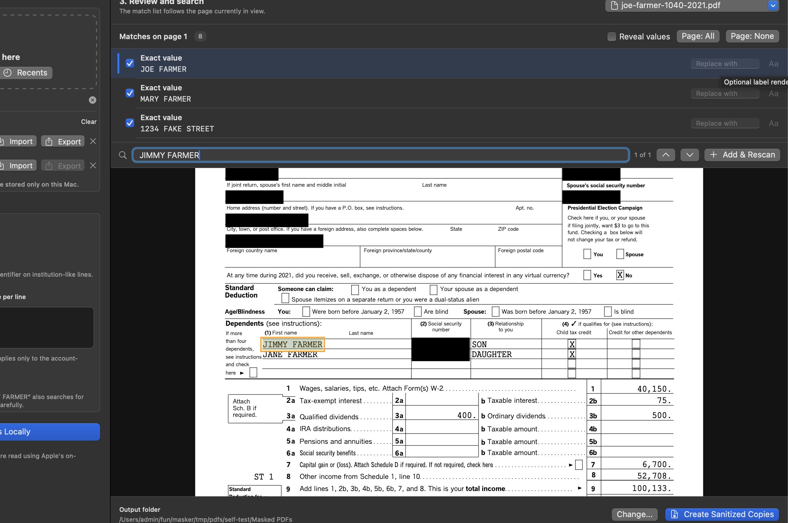
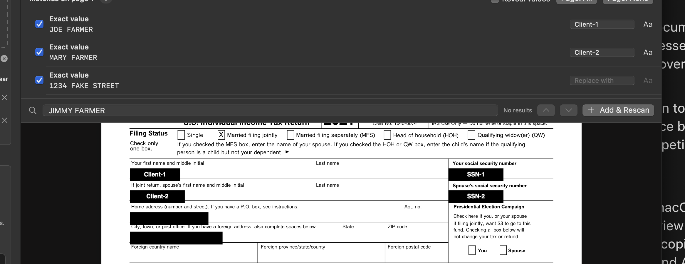

# I built a local PDF redactor because Preview made me click too much

I needed to share a folder of financial documents with a tax strategist. The useful parts were the institutions, holdings, transactions, and amounts. The unnecessary parts were names, addresses, tax IDs, phone numbers, and account numbers repeated across hundreds of pages.

Preview can permanently redact a PDF, but I still had to find and select every occurrence by hand. I built [Masker](https://github.com/cpatil/masker) to automate that repetitive part while keeping the review in front of me.

Masker is a native macOS app. PDFKit handles PDFs, Apple's Vision framework handles on-device OCR, and nothing is uploaded.

## What I use it for

The first use case is preparing tax returns, brokerage statements, K-1s, and supporting reports for an adviser who needs the financial information but not the account identifiers or personal details.

There are a few variations of that problem:

- Remove the same household names, addresses, SSNs, EINs, emails, and phone numbers everywhere they appear.
- Keep a bank or brokerage name visible while masking only the trailing account identifier. `EXAMPLE BANK - 1234` becomes `EXAMPLE BANK - ████`; the institution and amount columns remain useful.
- Reuse one set of values across several PDFs or a later year's documents instead of starting over.
- Replace a value with a stable label such as `Client-1`, `Client-2`, or `Account-1` when the recipient still needs to distinguish people or accounts.
- Handle scanned statements as well as PDFs with a normal text layer.

## Review the whole document

Masker shows the full PDF as a continuous scroll. The match list follows the page currently in view, and clicking a black mask jumps back to its review row. Matches can be unchecked individually before export.

*This is a generated Joe Farmer fixture, not a real tax return. The left side controls what to find; the top-right list controls what will actually be masked on the visible page.*

Matching is case-insensitive and uses word boundaries, so a saved value such as `1234 Fake Street` can find `1234 FAKE STREET` without a short value such as `PATI` masking part of `Participation`. When values overlap, the longest value wins.

The automatic detectors cover SSNs and ITINs, EINs, email addresses, US phone numbers, and institution-style account suffixes. A formatted SSN or EIN also finds its compact version without dashes. Name variants are optional: a value such as `JOE AND MARY FARMER` can also look for `JOE FARMER`.

## Search for what the rules missed

Automatic matching is only a starting point. The incremental search box works like Preview's: type a possible leftover, move through the results, then add it to the shared mask set and rescan. Results already covered by selected masks are omitted, which makes this useful as a final sweep rather than a list of things already handled.

*Here the main names, address, and SSNs are already covered. Searching for `JIMMY FARMER` isolates one remaining visible name so it can be added and rescanned.*

## Black boxes when possible, labels when useful

The default output is a plain black mask. An optional **Replace with** field draws a short white label into the mask. Identical values reuse the same label, while two different accounts at the same institution can be `Account-1` and `Account-2`.

*The labels preserve relationships without preserving the original values. Font, maximum size, width, alignment, and text orientation can be adjusted or inferred for each occurrence.*

The portable JSON export stores the value-to-label mapping and label appearance, not page numbers or coordinates. That lets the same mapping be applied to another PDF where the value appears in a different place.

## A private batch across many PDFs

Version 1.7 adds a two-pass private-batch workflow:

1. Choose a folder inside Masker.
2. Review the first PDF, add values and labels, then continue through the folder.
3. If the shared mask set changes, earlier reviews are marked stale.
4. Start the final pass only after every PDF has been reviewed at least once.
5. Rescan, review, and export each PDF with the finished mask set.

There is also an optional MCP companion for coordinating that sequence from Codex. Codex can ask Masker to open the next opaque document, start a local scan, mark the current review complete, and report counts. The MCP server does not return filenames, paths, PDF text, mask values, labels, search results, or screenshots. Folder selection and every consequential review remain in the native app.

## The export and the tests

Each exported page is rebuilt from sanitized pixels at 300 DPI. The original text layer, forms, annotations, attachments, scripts, layers, and metadata are not copied. Preview may OCR the visible output again, but the selected values are no longer in the pixels.

This was vibe-coded with Codex. The test suite uses generated PDFs, including the fake Joe Farmer return in these screenshots. It covers searchable and scanned pages, rotations, overlapping and partial-word matches, account suffixes, labels, JSON portability, rescans, batch-state privacy, and both current and legacy MCP clients. Export tests run text extraction and OCR again to verify that selected values are gone.

Masker is open source. The universal Apple Silicon/Intel app and the optional MCP companion are available from the [latest GitHub release](https://github.com/cpatil/masker/releases/latest).
